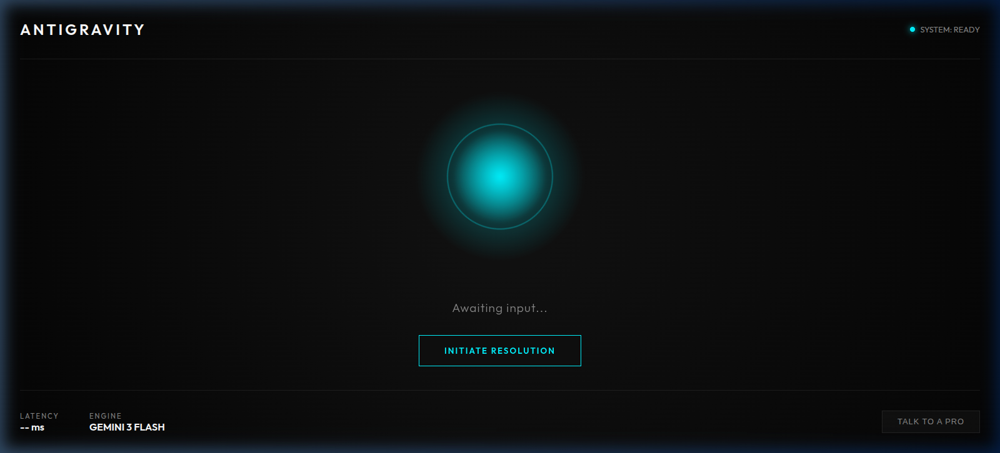

# Antigravity Agent | Agentic Wellness Platform
> "Stop completing tracks. Start resolving states."

[](./meditation_app_ui_1778244658928.png)

## 📌 Project Overview
The **Antigravity Agent** is a production-grade Agentic Workforce platform designed to provide instant mental clarity through AI-driven "Micro-Resets" and seamless human coaching integration. Built for the "Instant Economy," it treats mental wellness as a system uptime problem—resolving "mental lag" with sub-200ms precision.

This project showcases a full-stack, AgentMesh architecture where AI and humans collaborate to deliver a unified "Resolution-First" service.

## 🚀 Key Features
- **Voice-First Latency Loop**: Utilizes **Gemini 3 Flash** for context-aware multi-modal reasoning and **ElevenLabs Flash v2.5** for near-instant text-to-speech, achieving a sub-200ms latency.
- **"Mission Control" Interface**: A high-end, dark-mode dashboard featuring a central, frequency-reactive "Gravity Well" (Orb) built with Vanilla HTML/CSS/JS and the **Web Audio API**.
- **Automated Service Delivery**: Seamless integration with **Zoho CRM** (for lead capture) and **Zoho FSM** (for automated technician-style coach dispatch) via Zapier webhooks.
- **Version-Controlled Personas**: A modular `prompt_vault.py` backend system supporting distinct AI guides (e.g., Zen Master, High-Performance Coach).

## 🛠️ Technology Stack
- **Frontend**: HTML5, Vanilla CSS3 (Glassmorphism), JavaScript, Web Audio API
- **Backend / AI Core**: Python, FastAPI, WebSockets
- **LLM / TTS**: Google Gemini 3 Flash, ElevenLabs Flash v2.5
- **Integrations & Ops**: Zoho CRM, Zoho FSM, Zapier

## 📁 Repository Structure
```
├── /frontend             # "Mission Control" UI & Web Audio Visualizer
├── /agent-logic          # FastAPI orchestrator & persona vault
├── /integrations         # Webhooks & Zoho dispatch bridge
├── ARCHITECTURE.md       # AgentMesh philosophy & system design
└── README.md             # This documentation
```

## 🚦 Getting Started
1. **Frontend**: Open `frontend/index.html` in your browser.
2. **Backend**:
   ```bash
   cd agent-logic
   python3 -m pip install -r requirements.txt
   python3 main.py
   ```
3. **Environment**: Add your `GEMINI_API_KEY`, `ELEVEN_LABS_API_KEY`, and `ZAPIER_ZOHO_WEBHOOK` to the `.env` file in the `agent-logic` directory.

---
*Developed by Ansdev as part of the **Agentic Workforce** portfolio.*